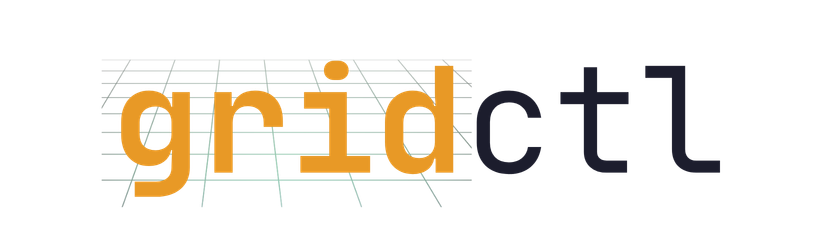

<p align="center">
  
</p>

<p align="center">
  <strong>One endpoint. Dozens of AI tools. Zero configuration drift.</strong>
</p>

<p align="center">
  <a href="https://github.com/gridctl/gridctl/releases"></a>
  <a href="LICENSE"></a>
  <a href="https://github.com/gridctl/gridctl/actions"></a>
  <a href="https://goreportcard.com/report/github.com/gridctl/gridctl"></a>
</p>

---


Gridctl aggregates tools from multiple [MCP](https://modelcontextprotocol.io/) servers into a single gateway. Connect Claude Desktop - or any MCP client - to your grid through one endpoint and start building.

Define your stack in YAML. Deploy with one command. Done.

```bash
gridctl deploy stack.yaml
```

> [!NOTE]
> **Inspiration** - This project was heavily influenced by [Containerlab](https://containerlab.dev), a project I've used heavily over the years to rapidly prototype repeatable environments for the purpose of validation, learning, and teaching. Just like Containerlab, Gridctl is designed for fast, ephemeral, stateless, and disposable environments.

## ⚡️ Why Gridctl

MCP servers are everywhere. Running them shouldn't require a PhD in container orchestration. Or, is the MCP server not running in a container? Is a single endpoint exposed behind an existing platform? Is another team hosting and managing an MCP server that is on a different machine on the same network? Different transport types, methods of hosting, and `.json` files start to accumulate like dust. 

I originally built this project to have a way to leverage a single configuration in my application, that I never have to update, while still building various combinations of MCP servers and Agents for rapid prototyping and learning.

I would rather be building than juggling ports, tracking environment variables, and hoping everything with my setup is ready for the next demo, no matter what servers or agents I'm using. My client now connects once and accesses everything over `localhost:8180/sse` by default.

```yaml
version: "1"
name: stack

mcp-servers:

  # Build GitHub MCP locally (instantiate in Docker container)
  - name: github
    image: ghcr.io/github/github-mcp-server:latest
    transport: stdio
    env:
      GITHUB_PERSONAL_ACCESS_TOKEN: "${GITHUB_PERSONAL_ACCESS_TOKEN}"

  # Connects to external SaaS/Cloud Atlassian Rovo MCP Server (breaks out into OAuth to connect)
  - name: atlassian
    command: ["npx", "mcp-remote", "https://mcp.atlassian.com/v1/sse"]

agents:

  # Test Agent - A2A
  - name: code-reviewer
    image: alpine:latest
    description: "AI assistant for code review and PR analysis"
    command: ["sh", "-c", "while true; do sleep 3600; done"]

    # Agent Level Filtering for Tools
    uses:
      - server: github
        tools: ["get_file_contents", "get_pull_request", "list_commits"]

    # Agent Definition
    a2a:
      enabled: true
      version: "1.0.0"
      skills:
        - id: review-code
          name: "Review Code"
          description: "Analyze code changes for bugs, style issues, and improvements"
          tags: ["code", "review", "quality"]
        - id: summarize-pr
          name: "Summarize PR"
          description: "Generate concise summaries of pull request changes"
          tags: ["summary", "documentation"]
```

Three servers. Three different transports. One endpoint. Navigate to [localhost:8180](localhost:8180) to visualize the stack 👉


## 🪛 Installation

```bash
# macOS / Linux
brew install gridctl/tap/gridctl
```


<details>
<summary>Other installation methods</summary>

```bash
# From source
git clone https://github.com/gridctl/gridctl
cd gridctl && make build

# Binary releases available at:
# https://github.com/gridctl/gridctl/releases
```

</details>

## 🚦 Quick Start

```bash
# Deploy the example stack
gridctl deploy examples/getting-started/skills-basic.yaml

# Check what's running
gridctl status

# Open the web UI
open http://localhost:8180

# Clean up
gridctl destroy examples/getting-started/skills-basic.yaml
```

## 🎬 Features

### Stack as Code

Fast, consistent, ephemeral, flexible, and version controlled! Many practitioners use different combinations of `MCP Servers` and `Agents` depending on what they are working on. Being able to instantiate, from a single file, the various combinations needed for the right task, saves time in _development_ and _prototyping_. The `stack.yaml` file is where you define this.

### Protocol Bridge

Aggregates tools from HTTP servers, stdio processes, SSH tunnels, and external URLs into a unified gateway. Automatic namespacing (`server__tool`) prevents collisions.

### Transport Flexibility

| Transport | Config | When to Use |
|:----------|:-------|:------------|
| **Container HTTP** | `image` + `port` | Dockerized MCP servers |
| **Container Stdio** | `image` + `transport: stdio` | Servers using stdin/stdout |
| **Local Process** | `command` | Host-native MCP servers |
| **SSH Tunnel** | `command` + `ssh.host` | Remote machine access |
| **External URL** | `url` | Existing infrastructure |

### Context Window Optimization _(access control)_

Are you paying for your own tokens for learning? Even if you aren't, being optimized is critical for not overloading that context window! Reducing the numbers of tools and scoping things out correctly, significantly reduces the likelihood of _"tool confusion"_ e.g., a given LLM selects a similarly named tool from the wrong server.

By using `uses` and `tools` filters in the _stack.yaml_ file, `gridctl` filters this list *before* it reaches the LLM. This way, you only get what you need. This is implemented at two levels:

#### Server-Level Filtering (`pkg/mcp/client.go`)

When `gridctl` initializes a connection to a downstream MCP server, it applies a whitelist during the `RefreshTools` phase.

```go
if len(c.toolWhitelist) > 0 {
    // Only tools in the whitelist are stored in the client's internal cache
    c.tools = filteredTools
}
```

#### Agent-Level Filtering (`pkg/mcp/gateway.go`)

The `Gateway` validates every tool list request and tool call against the agent's specific `ToolSelector` configuration.
- `HandleToolsListForAgent`: Filters the aggregated tool list dynamically based on the requesting agent's identity.
- `HandleToolsCallForAgent`: Provides a security layer by rejecting execution attempts for unauthorized tools, even if the model somehow knows the tool name.


#### Filtering in Action

**Server-Level Filtering** - Restrict which tools the server exposes to the gateway:

```yaml
mcp-servers:
  - name: github
    image: ghcr.io/github/github-mcp-server:latest
    transport: stdio
    tools: ["get_file_contents", "search_code", "list_commits", "get_issue", "get_pull_request"]
    env:
      GITHUB_PERSONAL_ACCESS_TOKEN: "${GITHUB_PERSONAL_ACCESS_TOKEN}"
```

This GitHub server only exposes read-only tools. Write operations like `create_issue` and `create_pull_request` are hidden from all agents.

**Agent-Level Filtering** - Further restrict which tools a specific agent can access:

```yaml
agents:
  - name: code-review-agent
    image: my-org/code-review:latest
    description: "Reviews pull requests and provides feedback"
    uses:
      - server: github
        tools: ["get_file_contents", "get_pull_request", "list_commits"]
```

This agent can only access three of the five tools exposed by the GitHub server - just enough to review code without searching the broader codebase.

### A2A Protocol

Limited [Agent-to-Agent](https://google.github.io/A2A/) protocol support. Expose your agents via `/.well-known/agent.json` or connect to remote A2A agents. Agents can use other agents as tools. `A2A` is still emerging, as is the common use-cases. This part of the project will continue to evolve in the future.

### Agent Skills Registry

Store reusable skills as [SKILL.md](https://agentskills.io) files — markdown documents with YAML frontmatter that get exposed to LLM clients as MCP prompts. Create them via the REST API, Web UI, or by dropping files into `~/.gridctl/registry/skills/`.

```
~/.gridctl/registry/skills/
└── code-review/
    ├── SKILL.md              # Frontmatter + markdown instructions
    └── references/           # Optional supporting files
```

Skills have three lifecycle states: **draft** (stored, not exposed), **active** (discoverable via MCP), and **disabled** (hidden without deletion). See [`examples/registry/`](examples/registry/) for working examples.

## 📚 CLI Reference

```bash
gridctl deploy <stack.yaml>          # Start containers and gateway
gridctl deploy <stack.yaml> -f       # Run in foreground (debug mode)
gridctl deploy <stack.yaml> -p 9000  # Custom gateway port
gridctl deploy <stack.yaml> --watch  # Watch for changes and hot reload
gridctl deploy <stack.yaml> --flash  # Deploy and auto-link LLM clients
gridctl status                       # Show running stacks
gridctl link                         # Connect an LLM client to the gateway
gridctl unlink                       # Remove gridctl from an LLM client
gridctl reload                       # Hot reload a running stack
gridctl destroy <stack.yaml>         # Stop and remove containers
```

## 🖥️ Connect LLM Application

The easiest way to connect is with `gridctl link`, which auto-detects installed LLM clients and injects the gateway configuration:

```bash
gridctl link              # Interactive: detect and select clients
gridctl link claude       # Link a specific client
gridctl link --all        # Link all detected clients at once
```

Supported clients: Claude Desktop, Claude Code, Cursor, Windsurf, VS Code, Gemini, Continue, Cline, AnythingLLM, Roo, Zed, Goose

<details>
<summary>Manual configuration</summary>

#### Most Applications
```json
{
  "mcpServers": {
    "gridctl": {
      "url": "http://localhost:8180/sse"
    }
  }
}
```

#### Claude Desktop
```json
{
  "mcpServers": {
    "gridctl": {
      "command": "npx",
      "args": ["-y", "mcp-remote", "http://localhost:8180/sse", "--allow-http", "--transport", "sse-only"]
    }
  }
}
```

Restart Claude Desktop after editing. All tools from your stack are now available.

</details>

## 📙 Examples

| Example | What It Shows |
|:--------|:--------------|
| [`agent-basic.yaml`](examples/getting-started/agent-basic.yaml) | Stack definition with agents and access control |
| [`skills-basic.yaml`](examples/getting-started/skills-basic.yaml) | Agents with A2A protocol |
| [`tool-filtering.yaml`](examples/access-control/tool-filtering.yaml) | Server and agent-level access control |
| [`local-mcp.yaml`](examples/transports/local-mcp.yaml) | Local process transport |
| [`ssh-mcp.yaml`](examples/transports/ssh-mcp.yaml) | SSH tunnel transport |
| [`external-mcp.yaml`](examples/transports/external-mcp.yaml) | External HTTP/SSE servers |
| [`gateway-basic.yaml`](examples/gateways/gateway-basic.yaml) | Gateway to an existing MCP server |
| [`gateway-remote.yaml`](examples/gateways/gateway-remote.yaml) | Remote access to Gridctl from other machines |
| [`basic-a2a.yaml`](examples/multi-agent/basic-a2a.yaml) | Agent-to-agent communication |
| [`multi-agent-skills.yaml`](examples/multi-agent/multi-agent-skills.yaml) | Agents equipping other agents as skills |
| [`github-mcp.yaml`](examples/platforms/github-mcp.yaml) | GitHub MCP server integration |
| [`atlassian-mcp.yaml`](examples/platforms/atlassian-mcp.yaml) | Atlassian Rovo (Jira, Confluence) integration |
| [`zapier-mcp.yaml`](examples/platforms/zapier-mcp.yaml) | Zapier automation platform integration |
| [`chrome-devtools-mcp.yaml`](examples/platforms/chrome-devtools-mcp.yaml) | Chrome DevTools browser automation |
| [`context7-mcp.yaml`](examples/platforms/context7-mcp.yaml) | Up-to-date library documentation |
| [`registry-basic.yaml`](examples/registry/registry-basic.yaml) | Agent Skills registry with a single server |
| [`registry-advanced.yaml`](examples/registry/registry-advanced.yaml) | Cross-server Agent Skills |

## 🤝 Contributing

See [CONTRIBUTING.md](CONTRIBUTING.md). We welcome PRs for new transport types, example stacks, and documentation improvements.

## 🪪 License

[Apache 2.0](LICENSE)

---

<p align="center">
  <sub>Built for engineers who'd rather be building and hate the absence of repeatable environments!</sub>
</p>
